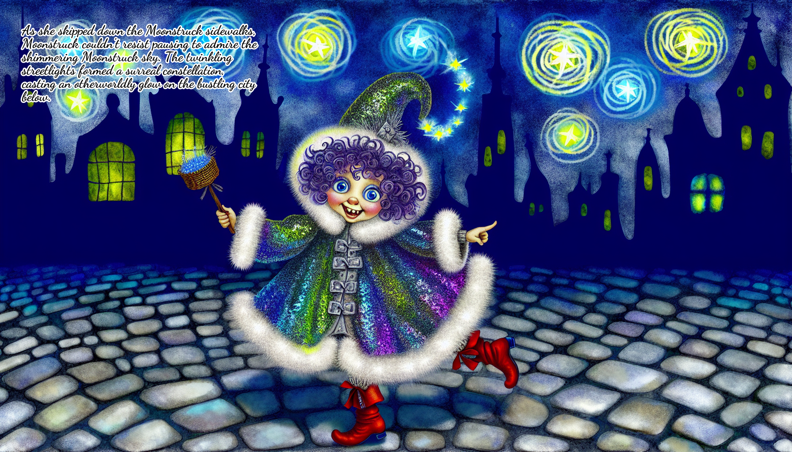

# riding-hood-generator
This repository was created as part of my work as a Generative AI Student Fellow for the Harvard course COMPLIT200.
"Little [COLOR] Riding Hood"

The project is a folk-tale generator that creates stories that extend the basic idea of Bruno Munari's [series](https://drive.google.com/drive/folders/1vCqCoXAuXA0e5QBoMAbgaSXY8Y7fhT2p) of "Little [Color] Riding Hood" stories (*Little Yellow Riding Hood*, *Little Green Riding Hood*, *Little White Riding Hood*, etc).

The input for the program is a pantone color, for example "banana-crepe" or "moonstruck". 

The programm uses the Gemini API to generate the story content and the OpenAI API to generate the images. 

To create a Jupyter Notebook run the following command:
```bash 
pip install p2j
p2j complit.py
```
And then open the notebook with Jupyter Notebook or Google Colab.

The output of the program is a pdf file named "little-[color]-riding-hood.pdf" that contains the story and the images.

Here is an example of the output for the input "moonstruck":




